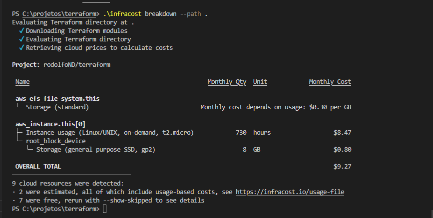
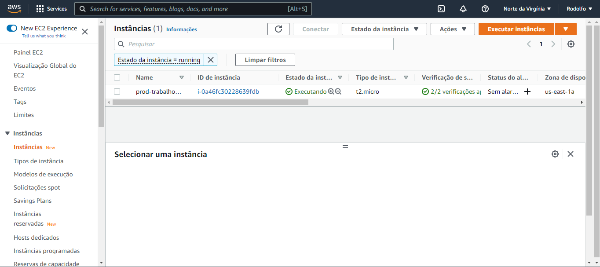
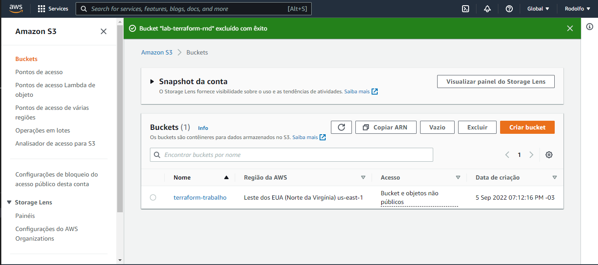
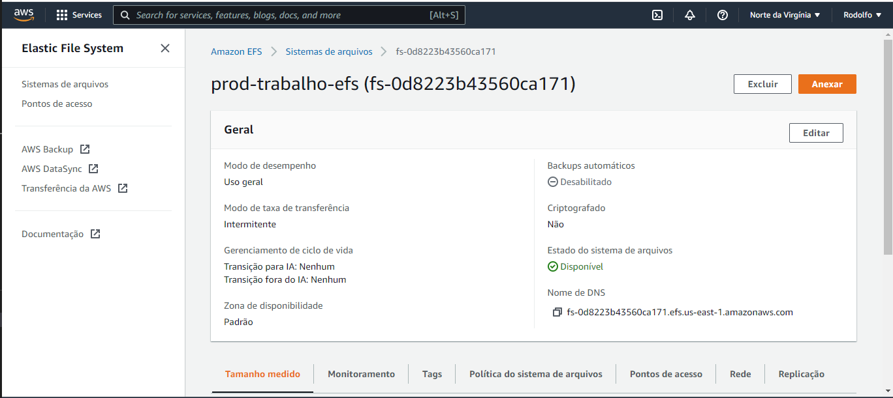

# Terraform
Rodolfo Nascimento Dimas
 
Arquitetura de Soluções
 
PUC-MG - 09/2022

## Custos estimados do projeto

  

<!-- BEGIN_TF_DOCS -->
## Requirements

| Name | Version |
|------|---------|
|  [aws](#requirement\_aws) | 4.26.0 |

## Providers

| Name | Version |
|------|---------|
|  [aws](#provider\_aws) | 4.26.0 |
|  [null](#provider\_null) | 3.1.1 |

## Modules

No modules.

## Resources

| Name | Type |
|------|------|
| [aws_efs_file_system.this](https://registry.terraform.io/providers/hashicorp/aws/4.26.0/docs/resources/efs_file_system) | resource |
| [aws_efs_mount_target.mount](https://registry.terraform.io/providers/hashicorp/aws/4.26.0/docs/resources/efs_mount_target) | resource |
| [aws_instance.this](https://registry.terraform.io/providers/hashicorp/aws/4.26.0/docs/resources/instance) | resource |
| [aws_internet_gateway.this](https://registry.terraform.io/providers/hashicorp/aws/4.26.0/docs/resources/internet_gateway) | resource |
| [aws_key_pair.this](https://registry.terraform.io/providers/hashicorp/aws/4.26.0/docs/resources/key_pair) | resource |
| [aws_route.this](https://registry.terraform.io/providers/hashicorp/aws/4.26.0/docs/resources/route) | resource |
| [aws_security_group.sg-web](https://registry.terraform.io/providers/hashicorp/aws/4.26.0/docs/resources/security_group) | resource |
| [aws_subnet.this](https://registry.terraform.io/providers/hashicorp/aws/4.26.0/docs/resources/subnet) | resource |
| [aws_vpc.this](https://registry.terraform.io/providers/hashicorp/aws/4.26.0/docs/resources/vpc) | resource |
| [null_resource.configure_nfs](https://registry.terraform.io/providers/hashicorp/null/latest/docs/resources/resource) | resource |
| [aws_ami.ubuntu](https://registry.terraform.io/providers/hashicorp/aws/4.26.0/docs/data-sources/ami) | data source |
| [aws_availability_zones.available](https://registry.terraform.io/providers/hashicorp/aws/4.26.0/docs/data-sources/availability_zones) | data source |

## Inputs

| Name | Description | Type | Default | Required |
|------|-------------|------|---------|:--------:|
|  [aws\_instance\_type](#input\_aws\_instance\_type) | n/a | `string` | n/a | yes |
|  [aws\_profile](#input\_aws\_profile) | n/a | `string` | n/a | yes |
|  [aws\_public\_key](#input\_aws\_public\_key) | value | `string` | n/a | yes |
|  [aws\_region](#input\_aws\_region) | n/a | `string` | n/a | yes |
|  [prefix](#input\_prefix) | n/a | `string` | n/a | yes |

## Outputs

No outputs.
<!-- END_TF_DOCS -->
 
 

# Evidências Funcionamento
## Site em funcionamento

  
  

 
 

## EC2

  
  

 
 

## Detalhes dentro da instância

  
  

 
 

## S3

  
  

 
 

## EFS

  

 
 

## Terraform destroy

  

